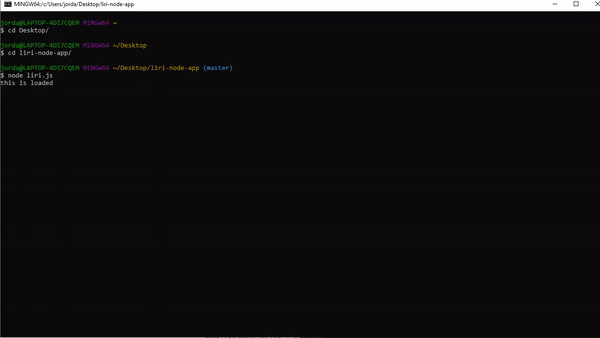

# Liri Node App

## Summary
This is my liri node app. It functions to search for a movie, concert, or song the user inputs in the command window. It also returns a random movie, song, or concert if the user selects the random choice in the initial prompt.

## Functionality Video



## Technologies Used 
- HTML - Used to create elements on the DOM
- JS - Used to manipulate content on HTML
- Node - Executes JavaScript code outside of a browser
- Git - Version control system to track changes to source code
- Github - Hosts repository that can be deployed to GitHub pages

## Code Snippet
The following code shows how the axios package is loaded on the js file. 
```js
var axios = require("axios");
```

## Author Links
https://github.com/hagoodj

https://www.linkedin.com/in/jordan-hagood/
